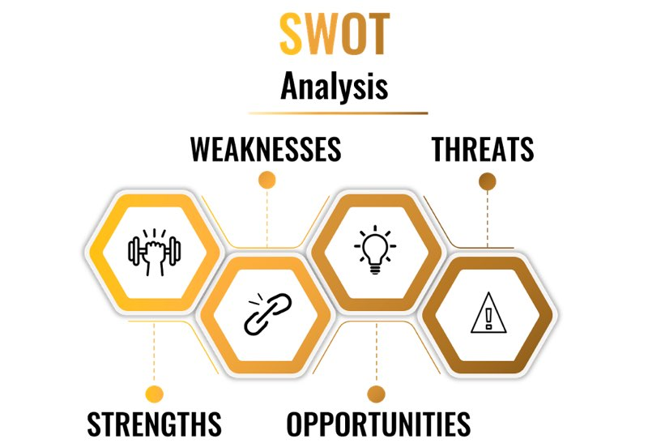

你还记得每个人“最喜欢”名单上的那个高中生吗？拥有所有可爱女友的家伙，是校足球队的明星运动员和“A”级学生？他似乎是那么的自信，没有什么可以阻止他实现他的心愿。
我敢肯定，有时你会嫉妒他，并希望自己也能受到同样的钦佩。那些是我们通常认为非常自信的人，他们会在这个世界上“相处融洽”。我遇到过很多这样的人，他们表面上看起来非常自信，但当你深入挖掘时，你往往会发现他们的自信仅限于特定的情况或能力。最重要的是，他们还有多少自尊的问题，这与自信完全不同。
可能是那个高中生在很多方面都闪闪发光，却没有自信去反对父母。所以，当我们谈论自信时，它并不像我们最初想象的那么简单。如今，专家们几乎一致认为，自信并不意味着你可以在每种特定情况下都能成功运作。虽然对自己有信心是一件美妙的事情，但只有当它得到更深层次的自我价值感的支持时，它才能完全为你服务。

## 你有多自信？

如果从这个角度来看，自信往往被高估了；它不一定能保证生活中的成功，尽管它可以发挥至关重要的作用。如果我在 1 到 5 的范围内问你有多少自信（1 表示完全没有，5 表示非常自信），这是一个很好的指标，可以表明你对自己的总体看法，但没有透露你真正的长处和短处。
你可能对自己的身体能力非常自信，而对自己的智力则不太自信，反之亦然。可能是你在工作中感到非常自信，但不能很好地管理你的人际关系。也许你在家里做 DIY 工作时表现出自信，但对处理财务问题没有信心。你看，自信是你在生活的某些方面可能拥有的东西，而在其他方面没有，这没关系。
关键是要明白，拥有自信绝对是加分项，但这取决于一系列因素，其中许多是可以改进的。如果你想知道如何定义自信，你可以说它是对自己的信念以及对自己应对日常挑战和目标的能力的信任。我什至可以更进一步说，拥有自信会带来更大的快乐，因为当你确信自己的能力时，你会给你的生活带来更多的成功。如果你成功地实现了你的目标，你就会更有动力朝着新的目标努力，在每一步都让你充满个人满足感。
现在是思考你对生活的哪些方面感到自信的好时机，以及你认为哪些方面阻碍了你发挥全部潜力或让你受苦。你可以列出你觉得最自信的领域和你觉得缺乏的领域。例如，你可以注意到，你对自己的职业技能感到自信，但在结识新朋友时却没有那么自信。如果你的清单充满优点而没有缺点，那就太好了！如果你想不出你对生活中的任何领域感到自信，那也没关系——这就是我在这里的原因。我想让你知道，你可以在对你最重要的领域增加信心。
**我想强调的一件事是：自信更多地与你如何看待自己有关，而不是你真正有能力做什么。**
为什么？因为自信基本上意味着你对自己的能力、品质和判断力感到安全。换句话说，你对自己有多少信任。这与其他人如何看待你、你的墙上有多少赞誉或你认为自己有多少朋友无关。自信远不止于此——它是关于你对自己的信念。

## 为什么自信如此重要？
通过建立自信，你可以体验：

- 更大的自我价值
- 生活更有趣
- 行动自由，无需怀疑自己
- 减少焦虑和压力感
- 更多的能量和动力
- 更好地与他人互动

从以上几点可以看出，拥有自信可以让你真正拥抱生活和它所提供给你的一切。它不仅能让你自我感觉良好，还能帮助你取得更多成就并建立更牢固的关系。这可以带来巨大的满足感，并为你的生活赋予真正的意义。不仅如此，还有大量研究表明自信对你积极的心理健康有多么重要，各种研究证明了对自己的能力感到确定与健康的心态之间存在联系。

### 缺乏自信是什么样子的？

缺乏自信会限制你对生活的快乐程度，这就是为什么要深入了解你对自己造成的任何负面印象是很重要的。但是，当某人缺乏自信时，我们如何确定它的样子，或者你是否患有此病？下面，你将找到一些共同特征，如果你能在阅读它们时考虑与它们的关联程度，这将很有用。你认得自己吗？

1. 感觉你对自己不确定，即使是在处理你熟悉的主题时也是如此。
2. 避免困难的任务，因为你担心你可能无法成功完成它们。
3. 过分担心你犯的错误可能比其他人通常会做的更久。
4. 告诉自己你不够好——还记得第 1 章中消极的内心批评者吗？
5. 感觉到生活中缺少某些东西，并期望其他人或事物为你提供。
6. 经历自我怀疑和逃避责任或采取特定立场。
7. 由于害怕被嘲笑或不被重视而难以表达你的观点。
8. 不愿意问问题，因为你不想显得“愚蠢”。
9. 避免任何需要你在公共场合发言或受到关注的活动。
10. 未能表现出主动性并更愿意遵循指示。
11. 面对批评或反对时不为自己挺身而出。
12. 避免任何可能让你感到暴露的对话。
13. 让他人负责而不是承担领导角色。
14. 无法与比你更自信、更有统治力的人打交道。

很自然地涉及到以上几点。在我们的生活中，我们都会经历一些时期，我们的信心可能会因发生在我们身上的事情而受到损害。我可以回忆起过去很多次我因为事情没有按照我的方式而感到沮丧，但诀窍是要有一个有弹性的心态，帮助你回到正轨。
在追求我的妻子 Daria 的过程中，我个人经历了上述所有事情。我想与你分享我们在 2012 年第一次见面的故事，并解释我们如何克服阻碍我们前进的一些障碍。
2011 年，我参加了一个名为“世界赛跑”的基督教宣教之旅。我和我的团队本应留在摩尔多瓦国家的一个地方部门，但我们的行程一夜之间改变到与乌克兰接壤的小州德涅斯特河沿岸地区。
到我们的目的地需要很长的巴士车程，当我们到达那里时，我和我的团队已经饿了，几乎没怎么睡。我们在 Tiraspol Church 的一个地方接待了我们，那里曾经是一个孤儿院。在我最没想到的时候，我们把车停在门口，Daria 和她的朋友站在那里等着帮助我的团队安顿下来。这听起来很疯狂，但我当时就知道她将成为我的妻子：那是一见钟情。
当我们在房间安顿下来时，我问她是否需要帮助洗碗或为我的团队收集任何需要的东西。我开始和她闲聊，希望那天之后能再见到她。大约一周后，我在一次教堂礼拜中再次见到她，最终问她是否愿意吃午饭，或者去散散步，因为我需要在一切都太晚之前告诉她我对她的感觉。在我们散步的过程中，我们坐在公园的长凳上，和她分享我内心的想法需要每一分勇气。一想到被拒绝，我就害怕，但我知道我需要尝试。我告诉她我的感受后，她回答说她也对我有感觉。我们讨论了现实情况，因为我们都知道这不会是一段轻松的旅程，因为这意味着要建立一段异地恋。然而，我们对彼此的爱很深，我们的信念更坚定，这就是最终让我们继续前进的原因。
这是极具挑战性的，从那时起我就面临着许多困难。我已经开始并在家里经营自己的生意，同时试图寻找机会回去拜访她。与 Daria 建立关系并获得她家人的信任对我来说非常重要。我们最终在 2014 年结婚，但由于 USCIS 丢失了我们的文件，我们在婚姻的第一年半分开了，这让我们别无选择，只能重新开始这个过程。繁文缛节和阻碍我们在一起的限制让我每时每刻都感到沮丧。最初，必须处理所有签证要求和文书工作令人生畏，但我们克服了一个又一个障碍，我们对彼此的坚持和爱终于有了结果。在互相追求的过程中，有人告诉我们这永远行不通，自我怀疑的个人斗争经常浮出水面。有很多日子我们一起笑过，一起哭过，但我们是如此相爱，如此投入，没有什么能阻止我们再次团聚。
最终，我们为她办理了签证，2016 年 3 月，我们终于能够成为真正的夫妻。 Daria 能够和我一起去美国，锦上添花的是她告诉我她在 2019 年怀上了我们的儿子。我觉得自己是最幸运的人！
像我上面描述的关于我个人故事的挑战是生活的一部分。这一切都是关于花时间看看情况，看看你能解决什么问题，然后继续你的道路。这绝对不是自责或自我批评，这两者只会阻碍你实现目标。你必须相信你能做到。
这听起来可能很明显，但事实是自信来自于你的内心——来自你自己。它不是你可以通过外部方式购买或获得的东西。如果你想对自己的能力更有信心，对自己更有信心，你必须从内心开始。在整个 Armour Your Mind 中，你会注意到我所建议的大部分内容都与你的内在自我——你的内在核心有关。你可以在自己的道路上受到他人的启发和鼓励，这很棒。但如果你不准备投入工作，你会在一段时间后动摇。

## 什么不是自信？
我还想提一下自信不是什么，因为围绕它有很多困惑，这可能会让你觉得自己做错了什么。我不是在谈论那些自满的吵闹的人：那些贬低其他人或表现得好像他们比你我都优越的人。你不必成为一个“无所不知”来证明你有多自信——这通常只是对那些感到不安全的人的掩饰。
过度自信有很多陷阱，所以关键是要找到正确的平衡点。想象一下，被一个自称是专家的人带领登上珠穆朗玛峰，而实际上，他从未爬过任何海拔超过 1000 米的山峰。这就是过度自信，完全不负责任。即使他相信自己有能力，但现实是他的自我远比他的实际能力大得多。
意识到自己的弱点与了解自己的优势同样重要，这是我之前提到的平衡的一部分。不擅长一切也可以——有缺陷和不完美。事实上，这完全是人类！当务之急是你意识到它们，因为没有看到你的弱点会导致你做出错误的选择或决定，这可能会对他人的生活产生毁灭性的影响，而不仅仅是你自己的。
一直认为自己是对的，拒绝倾听他人的意见，近乎傲慢，让周围的人感到自卑。这不是善待他人的好方法，即使你确信自己是正确的，也无需将自己的观点强加于人。我见过的一些最自信的人倾向于少说多听。制造热空气不会让你获得任何尊重，也不会让任何人相信你是爱因斯坦或勒布朗詹姆斯。大多数人都能看穿任何夸张，没有人喜欢被轻视或欺负——过度自信的人可能有一个坏习惯。
尽管我们生活的社会非常重视自信，但我也想提一下，这种推动我们所有人对自己感觉良好的做法也有一些负面影响。有趣的是，当我们努力做到最好时，社交媒体和一般媒体对我们寄予了许多不切实际的期望。许多人似乎倾向于自恋，这显然不是一种积极或健康的特征。最近的一项研究甚至将过去 50 年自信心的增强与自恋的兴起之间联系起来，因此请记住，我并不是在暗示这种极端形式的自我认知。

### 什么是自尊？

就像我之前提到的那样，可能有人看起来很自信，但自尊心仍然很低。那是因为自信和自尊是两个不同的东西。虽然你可能对自己的公开演讲技巧或运动能力感觉很好，但在内心深处，你可能对自己的评价很低。这种消极情绪通常源于我们的童年时代，要克服它要困难得多。好消息是，当你学会如何提高自尊水平时，你的信心也应该会增加。很少有人会找到自尊心高而自信度低的人。
我的一个非常成功的医生朋友在我的家乡有一个巨大的、豪华的手术室。作为一名神经科医生，他必须努力工作多年才能在这个高度专业化的医学领域取得资格并获得经验。走进他的办公室，你会情不自禁地注意到墙上挂满了他所有的文凭和证书，每次去拜访他，我都印象深刻。
有一天，我发表了一些评论，比如，“你的父母一定为你和你取得的成就感到骄傲。”当他回答说他的父亲仍然认为他是一个什么都做不好的孩子时，我对他的回答感到震惊。他解释说，无论他积累了多少资历，在内心深处，他都觉得自己永远无法赢得父亲的尊重。这让我感到非常难过，因为这位受人尊敬的专业人士仍在遭受父亲在他还是个孩子时所造成的低自尊的痛苦。
自尊与自我价值相同，都与我们对自己的重视程度有关。如果你对自己有很高的评价，并且对自己的身份感觉良好，那么无论你的环境如何，你都会拥有健康的自尊水平。你可以很穷，甚至流落街头，但仍然有自尊。它是你身心健康的核心要素，不仅对你的感受产生积极影响，还可以帮助你克服挑战并在工作或家庭环境中表现得更好。

### 为什么你的自尊很重要？

如果你觉得自己不值得，那么还有谁会珍惜你？这不仅是一个值得思考的问题，而且也是人类发展的关键。作为人类，我们不断进化，需要对自己有积极的看法，这满足了我们与他人结成联盟并成为一个群体的一部分的能力。所有这些最终都让我们有更好的生存机会，因为数量是安全的，所以我们仍然渴望社会接受也就不足为奇了。想象一下，如果有人自尊心低——谁会希望他们加入他们的团队或团队？
我们都想属于某个地方，感到被排斥并不是一个好的处境。它会导致强烈的孤独感，我们知道这与抑郁和焦虑有关。所以，我们有责任变得讨人喜欢，如果我们甚至不喜欢自己，那也不会发生。这是积极的社会反馈对我们如此重要的另一个原因，也是为什么许多人依赖（不幸的是）他们在社交媒体上的受欢迎程度来满足他们自己积极的自我看法。
我想我不需要告诉你，你的自尊水平越高，你找到伴侣和提高社会地位的机会就越大，而且对自己感觉良好。想象一下，如果你的伴侣也有很高的自尊……所有的研究都表明，作为一种人格特质，它有 50% 是遗传的，我们其余的发展依赖于环境因素。如果你看到你的杯子半满，那是个好消息，如果你看到它半空，那就不是好消息。但让我们希望你属于前一类，对吧？
与其说“我生来就是这样”，不如从不同的角度看待它，并欣赏自己有多少自我发展和成长的潜力。这是我坚信的。当你的环境是积极的和培育的，这是一个很大的帮助。当它不那么支持和关怀时，这不是为自己感到难过并退出的借口。如果你能挖掘快乐的内在愿望，你就会更加努力地实现你的目标，并最终习惯于收获它的回报。所需要的只是行为和思维方式的转变。
永远不要忘记自我实现的预言：如果你认为你会失败，你可能会因为自我破坏而失败。这强化了你对失败的初步看法，而如果你相信自己可以实现目标并有目的地追求它们，那么你就更有可能成功。这会强化你的观点，即你可以成功，从而进一步提升你的自尊心！

## 如何增强自信心
当谈到心理韧性时，信心在帮助你打造盔甲并让你更有弹性的属性列表中居于首位。能够适应挑战并承受比其他人更少的压力是韧性的标志，可以通过应用不同的策略来学习。如果你相信自己有能力解决问题，那么你就已经在寻找解决方案的路上了，并且不太可能在出现问题时惊慌失措。除此之外，通过获得自信，你有可能会继续坚持，直到获得积极的结果，并且不会在遇到困难的第一个迹象时就放弃。当你处于这种模式时，你总是更有可能成功，这也会增加你的自信心。

### 我最重要的自信建立策略

自信不是伪装。你可能曾处于极度紧张并试图隐藏的情况，但有许多迹象可能会出卖你。这些迹象可以从你的肢体语言、你说的话、你的着装甚至你告诉自己的话中明显看出，所以我不建议你假装，因为那是肤浅的。你需要做的是从相信自己开始——那是将你的盔甲固定在一起的织物。
有很多方法可以让你对自己更有信心，而这一切都始于你对自己的看法。它与除此之外的任何东西都没有联系。当然，有人可以赞美你，你会在一天的剩余时间里感觉很好，但是当有人侮辱你时会发生什么？你打算让它毁了你的一天吗？不！相信自己的价值、价值和精神力量必须从自己开始，获得自信是其中的一部分。
这里有一些策略，你可以用来强化你的自我形象，同时也创造你想要传达给世界的正确印象。通过应用这些策略，你会看到结果，它们将成为改变生活的习惯，你会想知道你以前没有做过什么。

#### 纠正你的肢体语言

一个简单的事实是，当你看起来很自信时，你就会感到自信，即使一开始看起来很困难，也有一些方法可以练习改善你的肢体语言。在家中尽可能多地尝试所有这些技巧，直到它们开始变得自然。
**站直** 。你永远不会看到一个肩膀驼背的士兵在关注的位置，所以纠正你的姿势并站直。这散发出比你想象的更多的信心。当你觉得自己可能无精打采时，请检查一下自己，只需将肩膀向后抬起并抬起头即可。
**一致的看法**。与他们交谈时，直视对方的眼睛。其他任何事情只会让你看起来回避、不确定，甚至不值得信任。眼神接触也表明你对对方所说的话感兴趣，但注意不要一直盯着他们看，这可能会令人生畏。对于任何给定的交互，大约 60% 的目光接触是有益的。
**保持专注**。在谈话中坐立不安会让对方分心，这是你紧张的明显迹象。如果你无法避免，请尽量将其保持在最低限度，并练习将双手放松地放在膝盖上。无论你身在何处，都可以这样做，很快就会看到它让你感到多么平静。
**慢慢来**。挥舞双臂和走得太快给人的印象是你很烦躁，这并不能传达出自信。通过在头脑中以有规律、缓慢的速度数数来减慢速度，并让你的身体按照这种节奏移动。
**像你说的那样握手**。握手表示你很平静地来，很高兴见到对方，所以要握紧（而不是紧握）。你可以通过握手来练习，直到你确切了解哪种握法感觉牢固和稳定。

#### 自信地沟通

你说的话和你说的方式会告诉你很多关于你的信息。有时，我们在谈话时确实表现出缺乏信心，但不要被推迟。有很多方法可以克服这一点，并逐渐建立你的自信心。考虑以下问题，看看你需要做什么——熟能生巧。
**清楚**。说出你想说的话，不要吝啬你的话。如果你想说不，那就说不。你不必为你的答案辩护或用冗长的解释来证明你的立场。所有人都明白一个明确的“不”。
**保持简短**。当你开始谈话时，不要一开始就详细解释你来自哪里。这为你似乎对自己缺乏安全感的谈话定下了基调。当涉及到你对特定问题的看法时，只需陈述你的信念，而不必觉得你必须证明自己的立场是正确的。
**坚持你所相信的**。有自信的人不会在反对的第一个迹象中破裂并加入另一方。坚持你的信念并忠于你的价值观和观点——它们很重要。
**展示兴趣**。提出问题以表明你一直在关注对方所说的话，并表达出对他们的真正兴趣。这是一个不怕脆弱或承认自己并不了解一切并与他人建立更好关系的人的行为。
**表示尊重**。你可能不同意对方的观点，但尊重他们表明你不会因为不同的观点而感到害怕或威胁，因为你对自己的观点很自信。
**慢慢地说**。滔滔不绝和漫无边际并不能传达信心，会使听者感到困惑或更糟。此外，请注意可能、只是和可能等词，因为它们都表现出自我怀疑或犹豫。

#### 进行SWOT分析

这是深入了解自己并帮助你评估目标和抱负的好方法。
SWOT 是“优势”、“劣势”、“机会”和“威胁”的首字母缩写词，是一项有用的练习，可以帮助你理清思路并确定目标。
你可以通过在一张纸上绘制四个框来轻松完成此操作。第一个框的标题是优势，第二个框是弱点，第三个框是机会，第四个框的标题是威胁。
在第一个方框中，简单地写下你认为自己的长处。它可以是任何东西，从你天生的技能到你学到的东西，或者你的才能。
在第二个方框中，弱点，看看你对自己不满意的一些事情并写下来。你可以包括坏习惯、负面特征、缺乏某些技能或最近的失败。
在第三个方框“机会”中，查看你可以利用的外部因素。你可以考虑一些事情，比如你认识的人、帮助你提升技能的课程、社交活动或积极改变的可行性。
在最后一个方框中，威胁，想想可能会阻止你实现目标的事情。你可以写下你在途中可能遇到的障碍、实际挑战以及金钱或生活安排等因素。

#### 停止与他人比较

你永远不会和别人一样，因为你是独一无二的。无论你如何比较和对比，试图像别人一样或以他们的标准来判断自己永远不会让你感到快乐。你生命中唯一需要的批评者就是你！

- 以自己为基准，按照自己的价值观、观点和梦想生活。没有比这更好的方法来获得自信和自尊了。
- 与其看着别人的成就并贬低自己，不如庆祝自己的成就，无论多么小。
- 当你达到一个里程碑时奖励自己，即使它是一个小里程碑。当你宁愿呆在床上时，去健身房是件大事。给自己一个轻拍的背部这样做。
- 不要期望自己是完美的。没有人是完美无缺的，相信我！
- 不要再假设每个人都比你过得更好，或者更快乐、更富有、更成功，甚至更幸运。其他人在做什么并不重要。你为自己做什么才是最重要的。
- 当你失败时，请善待自己。要有自我同情心，不要停留在与其他人相比你没有取得的成就上。即使是顶级运动员也会跌倒，但他们会重新站起来继续跑步。
- 挑战你对自己的假设。忘记别人对你的看法，专注于你的品质、成就和抱负。你才是最重要的。
- 如果你有兴趣从真正能够帮助你的人那里获得启发，请找一位导师。导师可以指导你并培养你的积极品质，并在你需要时为你提供良好的建议。

这些年来我学到的一件事是，当我想实现某事时，关注他人的成就让我怀疑自己是否有能力实现它。这在某种程度上是一种精神折磨，而现在，我已经学会了使用情境意识来将注意力集中在我的目标上。我没有说“如果……怎么办”，而是着手制定行动计划，让我到达我想去的地方。这种狭隘的视野帮助我将注意力集中在奖品上，而不会被不确定性和自我怀疑分心。它并不能保证我一定会成功，但它给了我朝着目标努力的动力。为失败做好准备也是一个很好的策略，因为通过考虑我在途中可能面临的任何挫折或障碍，我可以尽早采取措施来克服它们。
如果你失败了，把它当作一个教训，因为它就是这样。它永远不会是世界末日。下次你只需要做好更多准备，更加努力，并注意什么会破坏你的计划。如果你因为自我怀疑而推迟做某事，那么现在是停止与他人比较并追求梦想的时候了。我知道你有力量和意志力去实现它！

#### 发现信仰的力量
对我来说，信仰非常重要，我个人对上帝的信仰引导我度过了许多艰难的时刻。没有我的信仰，我不知道我现在是否会在这里。正是我的信念帮助我在困难时期继续前进，它继续让我充满希望和乐观。你可能有自己的信念，并尽你所能地按照它们生活，那没关系。我们都同意不要仅仅通过我们的精神生活来判断彼此，而是在多样性面前建立团结。对我来说，上帝创造我们是地球上的盐和光，而不是坚韧不拔的黑灰。生活要按照他的旨意而不是别人的旨意过，自尊根植于他对我们的爱。

- 你可以用信心来培养你的信心，因为按照上帝的计划生活会帮助你看到你作为一个人的价值。不要受他人意见的影响，而要相信上帝，他总是看到你真正的价值。无论如何，倾听不同的观点，但不要让这些词定义你，因为观点会随着时间而改变，而上帝的爱却是坚定不移的。
- 记住，当你有信心时，没有什么是不可能的。你对自己施加的限制是人为的，当你处于消极的境地时，你什么也做不了。相信上帝让我相信一切皆有可能，而且我已经看到这在我生活的许多方面表现出来。
- 无论你经历过什么，也不管你带着什么感情伤痕，有信心会抵消所有的痛苦。让你受苦并不是上帝的计划，所以不要把力量赋予你生活中所有的伤害经历，而是拥抱快乐和爱。你应得的！
- 作为基督徒，我相信我们并不完美，但可以靠着神的恩典得救。无论你失败或偏离道路多少次，上帝的爱永远与你同在，自我同情是最重要的。对自己苛刻是破坏性的，并不能反映上帝对你的真正目的。你是人，上帝爱你，因为你是谁，所以学习自我接纳可以给你继续前进的勇气。如果你练习自我同情，你将开始对生活更加乐观，并为实现梦想的可能性敞开大门。另一方面，充满自我厌恶会让你一事无成。
- 改变对生活的看法取决于你，积极乐观对你的整体健康有很多好处。毕竟，你看待事物的方式会对你处理任何特定情况的方式产生巨大影响。消极会滋生消极和不作为，而积极的前景会鼓励行动和成功。相信太阳最终会发光来度过风暴是基于我对圣经的信仰和耶稣的爱。我从不觉得我一个人走路。
- 与其抱怨微不足道的小事，不如看看大局。数一数你的祝福，并感谢我们被赐予的这份美好的生命礼物。不管事情对你来说有多困难，重要的是要记住，那些享受生活中简单事物的人会体验到更大的幸福，尽管缺乏金钱或物质财富。与所爱的人在上帝面前度过的美好时光比世界上其他任何事情都更有价值，我每天都为此感谢。

当我们接近本章的结尾时，反思你的自我价值感是个好主意。你如何看待自己决定了你所经历的所有好或坏的感觉。通过改变这种心态，你可以开始获得更大的自信，这将推动你走向成功和幸福。我希望我上面列出的策略能帮助你做到这一点。一旦你决定实施它们，它们都是可以实现的，除了你对改善生活的承诺之外，不需要任何其他东西。
当你掌握自信时，你将获得第二件盔甲，你需要变得更有弹性，这将使你能够实现自己想要的任何目标。你将养成新的习惯，使你拥有实现目标并过上更充实生活的工具。我们将在下一章探索习惯，并研究阻止坏习惯和培养更健康生活方式的策略。
**我想不出比亚里士多德的名言更好的结束方式了，这是一条今天仍然适用的古老智慧。他说，**

> “我们就是要反复做。因此，卓越不是一种行为而是一种习惯。 ”
> 亚里士多德

让我们在下一章中确切了解如何将其应用于你的优势！