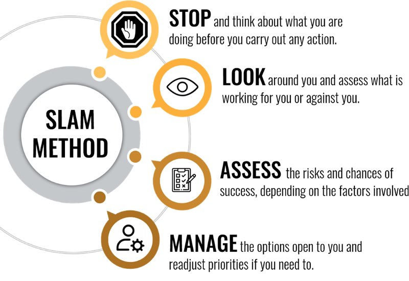

我们都钦佩从事高风险工作的人，例如飞行员、消防员和脑外科医生，他们的工作失败率预计为 0%。在这些情况下，一个失误可能是毁灭性的，不仅对执行任务的人而且对涉及的人也是如此。如果飞行员因为忙于与副驾驶谈论周末计划而没有注意他的仪表板，或者如果外科医生因手术刀掉到地板上而分心一毫秒，你可以想象这种场景。
这类工作需要高度的专注和专注。当你进行神经外科手术或撞到燃烧的建筑物时，你无法承受精神上的其他地方。这些男人和女人是我们的英雄：描绘了勇敢、专业和技能。那么，他们如何设法应对如此激烈的情况呢？他们的超能力是什么，你也能得到吗？
事情是这样的：这不是我们大多数人永远无法拥有的罕见性格特征。这是一种称为态势感知的软技能，就像任何其他技能一样，它可以通过经验来学习、构建和完善。
你可能想知道它在你的日常生活中有什么用处。你可能没有高风险工作，也不是特工或空中交通管制员，那么你为什么要担心态势感知？这是一个很好的问题，我将在本章中回答这个问题。
由于我们正在谈论第五件精神盔甲，即隧道视觉焦点，重要的是要了解如何更加了解周围发生的事情可以帮助你在任何给定时间专注于重要的事情。有能力对你所处的情况进行平衡评估，将确保你做出更好的决定并与你为自己设定的目标保持一致。在这方面，态势感知是一种宝贵的生活工具。
如果你开发出更好的态势感知能力，你就可以更轻松地管理信息、更有效地解释信息并将其用于你的优势。这是明智的决策，你可以在生活的各个方面从中受益。它在工作环境、人际关系以及未来的抱负或目标方面都非常有用。基本上，这意味着你有更大的控制权，每次都能获得更好的结果。
你可能在生活的某些方面失败的原因之一可能是因为你失去了注意力，这对许多人来说是非常正常的现象。随着我们周围的一切都在发生，过滤掉需要我们注意的东西并能够确定优先级可能会让人头疼。如今，我们受到如此多的刺激和无数分心的轰炸。有时，执行像写电子邮件这样的简单任务可能会感到不可能，更不用说完成人生目标了。我明白了——我们都因被白天发生的其他事情分散注意力而感到内疚，似乎不可能专注于我们需要做的任务或我们想要达到的目标。
这就是优先级的用武之地，因为如果你能学会选择你需要关注的事情，那么你成功的机会就会大大增加。我在很小的时候就参与了摔跤比赛，大多数运动员都会知道我在这里谈论的是什么。过去当我走到垫子上面对我的对手时，我显然可以看到人群、我的球队和教练，但是到了摔跤的时候，我唯一磨练的就是我面前的那个人.那时我唯一的目标就是打败他，我没有别的想法。我全神贯注于赢得比赛，我所有的注意力都集中在这一点上，没有别的。
这是许多运动员使用的那种“在区域内”的心态，我稍后会详细讨论它。现在，我想更多地谈谈态势感知以及如何应用它。人为因素在任何领域发挥重要作用的关键概念，例如在航空、指挥和控制或危机管理中，态势感知是人脑的一项功能，以及它如何应对复杂、动态或高风险设置。你可以说它描述了一个决策者在不断变化的任务情况下的心理模型，不难看出它是如何成为某些职业的基本技能的。
它也是你可以在日常生活中使用的工具。当你心中有一个目标或想要完成的事情时，情境意识可以真正提升你的游戏水平，因为它可以让你掌握对“环境”和其他可能影响你的目标的因素的意识和理解。你需要的是快速、适当的决策和有效的行动，如果你不观察周围发生的事情，你就不会拥有这些。
没有这种技能会导致错误，缺乏态势感知已被确定为人为错误导致事故的主要原因之一。从这个意义上说，这是一种避免不幸并实现你计划成功的方法。有数百个情况出错的例子，因为参与者并不完全了解可能影响他们决策的所有条件。例如，想想飞行员失误造成的毁灭性空中交通事故数量，你就会明白我的意思。这些都是极端情况，但缺乏态势感知也会对每个人的生活产生直接影响，无论他们参与什么。
这一切都归结为拥有正确的心态，知道那一刻你周围发生了什么。现在，你正在阅读这本书，而不是想你昨天的争论，或者你明天必须做的家务。然而，你仍然知道外面的噪音，天气，和你在一起的人，那个人在做什么。你根据这些因素做出决定，并优先考虑你想要或需要做什么。如果突然下雨，你可能不得不关上窗户，如果你的手机响了，你可以选择忽略它。这是描述你每天如何使用态势感知的一种简单方法，因此你有能力做到这一点。当谈到你的人生目标和梦想时，你也可以应用同样强大的技巧来帮助你取得成功。
想象一下，你已经乘坐新购入的哈雷戴维森 (Harley-Davidson) 开始穿越美国的公路旅行，但没有那么多经验。如果你不了解周围发生的事情，则存在多种风险和危险，其中许多可能危及生命，或者至少会缩短你的旅程。你需要了解环境中的元素，例如任何给定时刻的天气和道路状况。你需要能够解释它们的含义并在不久的将来预测它们的状态，以便你可以预测未来的任何问题。总之，你需要态势感知，它包含三个层次：感知、理解和投射。
1.**感知**
拥有感知意味着你可以从周围发生的一切事情中收集信息。这就像鸟瞰地形和 360 度视角。在公路旅行期间，你需要持续监控天气状况、交通状况、自行车的性能、身体感觉以及任何其他因素，以确保旅途安全。正是这种看法将帮助你实现目标。
2.**理解**
理解力与你理解和分析周围信息的方式有关。掌握正在发生的事情并能够正确解释将帮助你做出正确的决定。如果你在公路旅行中看到前方交通拥堵，你就知道必须减速。忽略那些预示大雨或引擎发出奇怪噪音的乌云会严重影响你的旅程，因此能够成功分析线索非常重要。
3.**投影**
你根据周围环境的信息预测结果的能力如何？能够根据你现在所知道的来预测未来并不需要水晶球。需要很好地掌握此时正在发生的事情，以便你可以自信地应对前方的任何障碍或挑战。骑着哈雷全速沿着 66 号公路行驶固然很棒，但是如果你想保持一体，能够预测如果你不得不突然刹车会发生什么，这绝对是你应该掌握的。
如你所见，感知、理解和投射并不是不可能获得的技能。你只需要完善它们，这样你就可以开始以更大的成功机会实现目标。拥有更强的态势感知并不能保证任何事情，因为总会有其他因素会破坏你的努力。你可能会承受很大的压力、经济困难或人际关系问题。所有这些似乎都难以控制，并且可能会占据你的注意力，从而为发展态势感知留下更少的空间。如果你正在服用任何类型的药物，这也会影响你的工作能力，所以如果你发现这个概念一开始难以应用，请不要对自己太苛刻。
给自己一个机会逐渐融入这个想法，并消除任何可能阻碍你的自我强加的限制。它不需要你对你的生活进行大的改造；仅仅通过思考这个想法，你就可以慢慢磨练你的技能，并达到一个有用的地步。你可以按照以下关键步骤开始，看看你的进展情况：

## 锻炼你的感知能力
这是一个很好的起点，可以轻松完成。首先要注意周围环境，使用所有感官。不要只看，而要听、闻和摸……否则你会错过多少东西。你练习的越多，你就越能养成了解周围环境的习惯。我想到的一个例子是，当我和妻子在高速公路上最左边的车道上行驶时，靠近拼车车道。车流比拼车车道慢得多，我注意到我们前面的司机多次向左看，因为她似乎想尝试进入那条车道。当我意识到发生了什么时，我放慢了速度，在我们和这辆车之间创造了很大的距离，然后最糟糕的事情发生了。我回头一看，我看到一辆车沿着拼车车道超速行驶，而我前面的司机冲进车道被撞了。我不得不猛踩刹车，幸运的是，我们没事，尽管我们前面的另外两辆车被撞得很惨。通过了解正在发生的事情，我为最坏的情况做好了准备，并毫发无损地走出了困境。

### 管理压力超载

压力会导致混乱，因为它会阻止你的大脑合理运作。即使在危机情况下，专业人士也必须保持头脑清醒；否则，可能会丧生。如果你承受压力，请记住你需要练习自我保健，包括优先处理你能处理和不能处理的事情。过度劳累、饮食不当或睡眠不足都会影响你的应对机制。一旦你消除了压力，你就能更好地在任何特定情况下做出有效的反应。

### 在未来的场景中想象自己

如果你突然失去工作或伴侣，你会如何反应？通过想象自己在未来的场景，如果发生这样的结果，你会做好更好的准备。我希望以上示例都不适用于你，但是为可能使你偏离目标的任何未来事件做计划很有用。这会给你一个处理陷阱的提示，因为你已经经历了头脑中的精神崩溃。你无法预测高速公路上会发生什么，正如我上面的例子所示，我们谁也没有预见到像 COVID-19 这样的全球大流行会永远改变我们共同未来的进程。但是你可以尝试想象自己处于测试环境中，并考虑你将如何应对它们。

### 停下来检查

一个值得养成的新习惯是，无论你在做什么，每天至少按一下暂停按钮片刻。对周围发生的事情进行快速的心理评估，并问自己诸如“我能听到什么？我能看到什么？”人们常说，我们对周围环境的关注不够，我们过滤掉了很多可能对我们有用的线索，所以现在停下来，简单地观察一下。你会注意到比你想象的要多得多。
你可以应用的一种技术是从职业工作空间的角度出发，称为 SLAM 方法。当你尝试实现最终目标时，它涉及可以在你的生活中实施的四个步骤，如下所示：

### 做好准备

如果事情没有按计划进行，请考虑可能的选择。如果你想完成某事，请写下所有可能出错的事情，并尝试确定如何补救它们。在没有降落伞的情况下，你不会跳出飞机进行跳伞冒险，对吗？如果你的滑道没有打开怎么办？拥有第二个安全滑槽就像拥有一个应急计划，并且你应该确保随身携带。这适用于生活中的大多数挑战。

### 字里行间

非语言线索可以帮助我们了解某人的真实想法或感受，因此关注这些线索是非常宝贵的。能够解读上司或合作伙伴的肢体语言可以让你更好地评估他们的状态，而不仅仅是听他们说的话，并且会帮助你了解是否需要改变计划或转移优先事项。毕竟，人们并不总是说他们的意思或说他们所说的。

### 注意你的直觉

我们中的许多人都忽略了我们的直觉，因为我们习惯于依赖确凿的证据，但它可能比我们认为的更有用。当事情感觉不对时，它通常是。你有没有经历过走进一个房间，感觉到有什么不对劲，但又不能完全把手指放在它上面？那是你的直觉，或者说是高度的意识，不幸的是我们大部分时间都不会听。开始更多地关注它，你会惊讶于它在正确评估情况方面的作用。
态势感知绝对是一项需要培养的重要技能，因为它可以让你看到更大的图景。通常，我们越是关注小细节，就越会错过很多其他有用的东西，从而在理解上留下空白。隧道视野会限制我们的所见所闻，并削弱我们对事件的感知，因此如果这是结果，那是不可取的。虽然狭隘的视野应该帮助我们保持专注于我们的目标，但过于专注也有其缺陷。你有多少次发现自己滚动浏览社交媒体帖子而没有听到房间里的其他人对你说的话？这是因为当你的大脑专注于视觉刺激时，它往往会忽略听觉信息，这被称为听觉排斥。
隧道视野也会限制你生活的其他领域，因为它成为一种排除其他选择的做事方式。除了如此强烈地专注于视觉活动以致于你听不到或看不到周围的任何其他事物外，你可能会在受到干扰时感到烦躁。即使其他人的意见可能是有益的，它也可能使你变得不灵活并且不接受建议，这可能意味着即使帮助有用，你也拒绝帮助。视野狭窄的另一个缺点是，你可能会连续工作数小时，从长远来看会适得其反。最终，你会忘记时间和空间，而忽略了其他优先事项。
最有效的方法是了解如何利用狭隘视野为你带来优势，并始终专注于你的目标。这一切都是为了找到平衡，以及在森林中迷路和盯着你想要到达的一棵树之间的区别。当你过于专注于一项任务时，你就会错过其他可能很重要的外围设备。这个想法是要了解你周围发生的事情，然后放大手头的工作。

### 同时在场并专注

在场意味着对此时此刻发生的所有事情有意识，同时仍然能够专注于你的想法。
这种运作方式可以帮助你保持觉知并完全适应。想象一下，这就像一个进行深度冥想的人，仍然能够感觉到一只落在他们鼻子上的苍蝇……他们可以感觉到它就在那里，但它没有阻止他们冥想。这需要一些纪律，但可以做到。在这方面，控制你的注意力对于建立心理弹性非常重要，你可以通过多种方式实现它。

### 设置日常不可协商的例程
我强烈建议的第一件事是建立某种不可协商的日常例程，这将帮助你专注于自己的目标。与其说“我明天就做”，不如在一天中划出时间来完成任务。什么时间都没有关系，只要它是实用的并且能让你朝着目标努力。确保你每天都坚持同一时间，没有例外。

### 设定切实的目标

如果你的目标完全不切实际，你就不可能专注于它超过五分钟。区分什么是可行的，什么是白日梦——我想你知道区别！这并不意味着你不能梦想远大。它只需要你每天采取一些小行动，这将产生累积效应，使你更接近实现最初的目标。我可以和你分享我生活中的一个很好的例子。多年来，我一直想制作一张全长摇滚专辑，其中包含我自己的所有歌曲。起初，这似乎是一项不可能完成的任务，但激情驱使我前进。我一步一步地到达那里，在我的制作人和朋友科迪和我终于能够拼凑起来之前将近一年。现在，当我听自己的音乐时，我不禁为自己所取得的成就感到自豪，因为这绝非易事。你可以通过追求自己热衷的事情，一天一天地享受同样的体验，并推动自己在生活中获得更多。

### 可视化你的最终结果

如果你想通过下一个培训模块，请想象自己持有证书。想存够钱买新房吗？想象一下自己坐在新露台上喝一杯冰镇饮料或一杯热咖啡。通过想象和宣布对最终结果的胜利，你实际上是在欺骗你的大脑，让你认为你已经实现了它们，所以你会得到一个血清素飙升，这会推动你继续朝着这些目标努力。

### 帮助自己保持专注

提醒自己你的目标是什么并将它们写下来，把它们放在显眼的地方。这可能在你的智能手机、汽车仪表板或计算机屏幕上。随着生活中所有的干扰不断发生，很容易被拦路，但如果你经常给自己视觉提示，它们将帮助你保持急需的注意力。

### 分享你的愿景

你不必独自行动，朋友或家人可以成为帮助你实现目标的有力支持。仅仅通过分享你的愿望，你就致力于实现它们，你会看到其他人是多么热衷于支持你完成你的使命。当你可能偏离目标时，有人支持你、鼓励你，甚至引导你，这是一个真正的优势。此外，通过分享你的愿景，你会变得负责任。如果你告诉你的朋友或家人你要去做某事，那么这会让你信守诺言，这会更加激励你取得成功。

### 不要一心多用

多任务处理被誉为一项伟大的技能，但如果你想完成特定的事情，如果同时有太多的球在空中，你的成功率就会下降。实现任何目标的诀窍是单一任务，这意味着一次只做一件事。例如，当我决定创作我的摇滚专辑时，我将我所有的精力都投入其中，直到完成为止。在那之后，我专注于为我的业务开发一个新产品，100% 的关注它。如果我尝试同时做这两件事，我可能会没有那么多的热情、时间和精力去工作，所以我可能永远不会成功地完成任何一项。

### 给机器喂食
你的大脑是世界上最高效的计算机，但它需要的不仅仅是肾上腺素来维持运转。你必须优先为它提供适量的优质睡眠和营养食品，并学会更缓慢地呼吸。每个人都知道良好的睡眠和均衡的饮食对健康的好处，但放慢呼吸速度也能使头脑静止，给它时间和空间来更好地为你服务。你可以每天尝试几分钟的简单呼吸技巧，并会立即注意到差异。
如果你还记得，在本章早些时候我谈到过“处于区域内”，即当你非常专注于特定的事情并且对周围发生的任何事情没有或很少有知觉时。如果你看到一名 NBA 球员投进那个关键的罚球，你可以看出他全神贯注于将球打入网中，似乎没有意识到在那个特定时刻他周围的噪音和活动。
这是一种特殊的隧道视觉，其中时间和声音似乎消失了，运动员和创意人员经常将其描述为几乎就像一种精神体验，一切皆有可能。世界一流的耐力铁人三项运动员和超跑运动员克里斯托弗·伯格兰 (Christopher Bergland) 将其描述为感觉好像他的身体成为了地球无限能量的管道，即使他已经筋疲力尽，也能推动他前进。当你感到受到启发但不不知所措时，就会出现这种高度状态，并且可以应用于你生活的任何方面，从锻炼到职业道路。
为了达到通常所说的“心流”状态，你需要在执行任务时不断调整思维的用途，以达到预期目标。如果你变得无聊或冷漠，这意味着你需要改变目标并进一步挑战自己。 “在区域内”并不是你每天都需要练习的东西，但是当你需要达到某个里程碑时，它可以给你额外的推动力。这通常是一种短暂的体验，因为你无法始终以那种强度发挥作用，但正如任何成功的运动员或有创造力的人会告诉你的那样，这可能是一次真正有益的体验。
我希望你从本章中学到的主要内容是，拥有隧道视觉焦点可以是一项巨大的财富，只要它伴随着态势感知技能。下次开始一个项目时，请考虑所有存在的参数：完成它所需的时间、所需的工具、所需的知识以及任何可能的结果。然后专注于你的目标，直到你看到结果。
这可能是你想要实现的实际目标，例如减掉几磅体重或为去欧洲旅行存够钱。也许这是一个以关系为导向的目标，你想与家人建立桥梁或寻找新的合作伙伴。你可能希望在内在自我的某些方面工作，这将有助于你感到更加自信和减少焦虑。
不管是什么，通过遵循上述建议，你将获得实现它所需的第五件盔甲。你可能想知道自己是否有足够的心理韧性开始这样一个改变人生的旅程，如果你想看到结果，这显然是一种需要培养的心态。即使拥有世界上最好的意志，如果没有一定程度的适应力，就无法实现任何目标：强大的特质使你能够管理和克服任何可能妨碍你的疑虑或担忧。
**心理韧性是我们下一章的主题，在那之前，我会留下一些鼓舞人心的话。谈到他在 NBA 的漫长职业生涯，迈克尔乔丹说：**

> “在我的职业生涯中，我错过了 9,000 多次投篮。我已经输了近 300 场比赛。我有 26 次被信任投出制胜球，但没投中。在我的生活中，我一次又一次地失败。这就是我成功的原因。”
> 迈克尔·乔丹

现在，让我们硬起来！